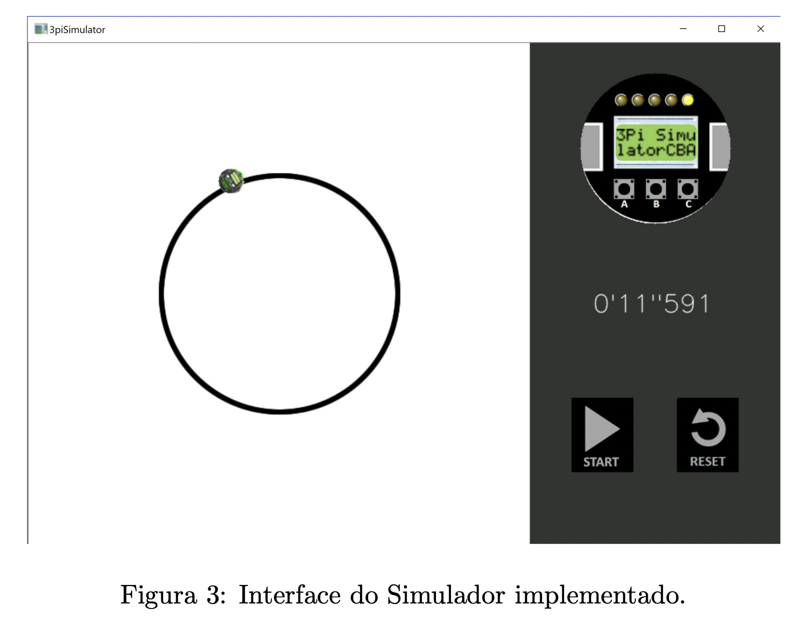

# 3pi

Simluador em C++ do robô 3Pi, da Pololu.

Este projeto gerou um artigo publicado em 2019.

Cite: *JUNIOR, JOSÉ ROBERTO FONSECA E. SILVA, et al. "[SIMULADOR DE CÓDIGO ABERTO PARA A PLATAFORMA POLOLU 3PI.](https://www.sba.org.br/open_journal_systems/index.php/cba/article/view/523)" Congresso Brasileiro de Automática-CBA. Vol. 1. No. 1. 2019.*

*Autores*:
* José Roberto Fonseca e Silva Junior
* Maria Helena Rocha de Alencar Aezerra
* Pedro Vitor Soares Gomes de Lima
* João Marcelo Xavier Natário Teixeira
* João Paulo Cerquinho Cajueiro
Guilherme Nunes Melo
